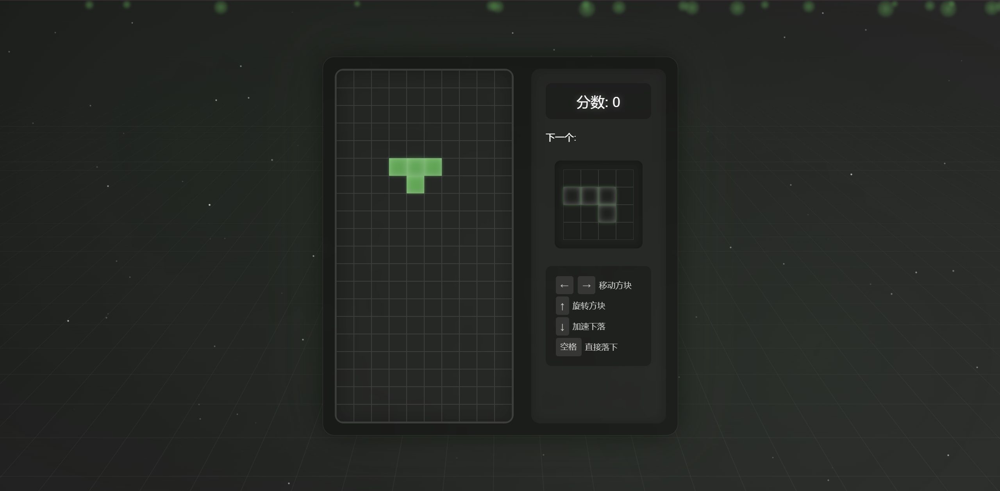
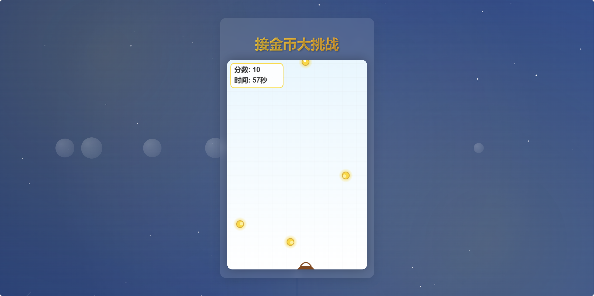

# 网页版经典游戏合集

- 俄罗斯方块
- 接金币

## 在线演示

- **俄罗斯方块**: [点击这里开始游戏](https://tianci1014.github.io/snake-lite/snake.html)
- **接金币**: [点击这里开始游戏](https://tianci1014.github.io/snake-lite/xijin.html)

**俄罗斯方块**

**接金币**

## 功能特点

**通用**

- 使用HTML5 Canvas绘制游戏画面
- CSS3实现动画效果和样式
- JavaScript实现游戏逻辑
- 使用requestAnimationFrame实现流畅动画
- 响应式设计

**俄罗斯方块**

- 经典的俄罗斯方块玩法
- 多种方块形状
- 关卡和分数系统
- 旋转和移动方块
- 消除行

**接金币**

- 简单的接金币玩法
- 实时分数显示
- 金币随机生成
- 倒计时

## 游戏控制

**通用**

- 游戏结束后点击"重新开始"按钮重新游戏

**俄罗斯方块**

- 使用方向键（↑ ↓ ← →）或 A/D 键控制方块的移动方向
- 使用空格键或 S 键旋转方块
- 按 P 键暂停/继续游戏

**接金币**

- 使用方向键（← →）或 A/D 键控制角色移动

## 游戏规则

**俄罗斯方块**

1. 不断下落的方块，可以通过操作改变方块的形状和位置
2. 当一行被方块填满时，该行会被消除并得分
3. 方块堆叠到顶部则游戏结束

**接金币**

1. 控制角色接住从上方掉落的金币
2. 接到金币增加分数
3. 倒计时结束时游戏结束

## 技术实现

- 使用HTML5 Canvas绘制游戏画面
- CSS3实现动画效果和样式
- JavaScript实现游戏逻辑
- 使用requestAnimationFrame实现流畅动画
- LocalStorage保存最高分记录 (未来计划)

## 本地运行

1. 克隆项目到本地
2. 使用浏览器打开相应的 HTML 文件 (tetris.html, coin-collector.html)
3. 开始游戏！

## 浏览器支持

- Chrome (推荐)
- Firefox
- Safari
- Edge

## 未来改进计划

- [ ] 添加音效 (所有游戏)
- [ ] 添加难度选择 (俄罗斯方块)
- [ ] 添加特殊道具 (接金币)
- [ ] 添加排行榜 (所有游戏)
- [ ] 优化移动端支持 (所有游戏)
- [ ] 增加更多游戏!

## 贡献

欢迎提交Issue和Pull Request！

## 许可证

MIT License 
